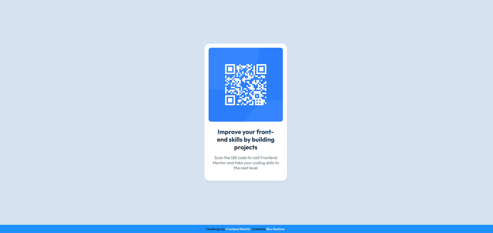

# Frontend Mentor - QR code component solution

This is a solution to the [QR code component challenge on Frontend Mentor](https://www.frontendmentor.io/challenges/qr-code-component-iux_sIO_H). Frontend Mentor challenges help you improve your coding skills by building realistic projects.

## Table of contents

- [Overview](#overview)
- [Screenshot](#screenshot)
- [Links](#links)
- [My process](#my-processes)
- [Built with](#built-with)
- [What I learned](#what-i-have-learnt)
- [Author](#author)
- [Acknowledgments](#acknowledgments)

## Overview

Here is the project of a QR code component that I have completed successfully using the available design, style-guide and figma software. The project was awesome and it provided me some knowledge of html, css flexbox and designing layout.

### Screenshot

Here are the required screenshots of both desktop and the mobile versions:



### Links

- Solution URL: [http://127.0.0.1:3000/Basics%20HTML%20&%20CSS/QR%20Code%20Component/qr-code-component-main/qr-code-component-main/index.html]
- Live Site URL: [Add live site URL here](https://your-live-site-url.com)

## My processes

(i) First- understand the design and layout, use Figma for insights.
(ii) Second- write html code.
(iii) Third- write basic css properties of the the elements.
(iv) Forth- write custom css properties and add comments where necessary.

### Built with

- Semantic HTML5 markup
- CSS custom properties
- Flexbox

### What I have learnt?

I have learnt the html div element, css flexbox, box-shadow, and  

```css
.proud-of-this-css {
  box-shadow: 2px 2px 30px hsla(216, 15%, 48%, 0.077);
}
```

## Author

- GitHub - [Biru Basfore](https://github.com/BiruMJ)
- Frontend Mentor - [@BiruMJ](https://www.frontendmentor.io/profile/BiruMJ)
- LinkedIn - [@biru-basfore-8b52262a4](www.linkedin.com/in/biru-basfore-8b52262a4)

## Acknowledgments

I have learned with the help of Full-Stack Web Development Bootcamp on Udemy by Angela Yu and freeCodeCamp.

Thank you!
